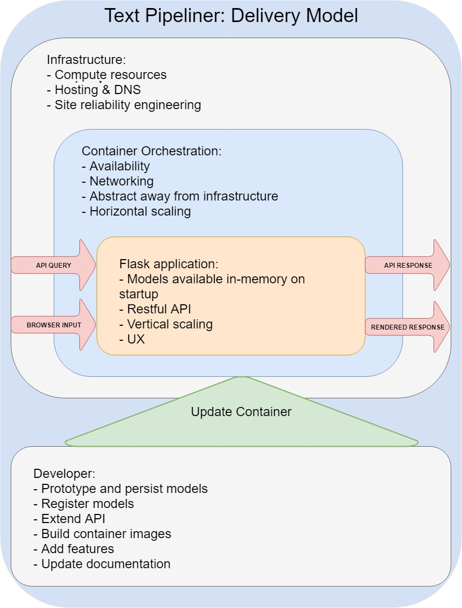
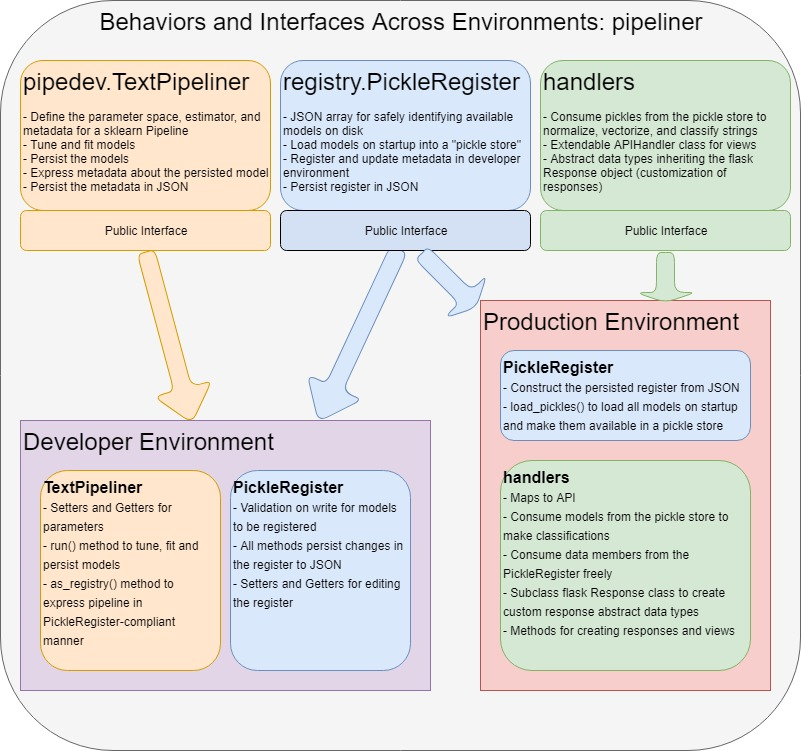

# Text Pipeliner
## Classifying News Articles and Showing How

This is Text Pipeliner, a tool for classifying news articles with SKLearn pipelines. Text Pipeliner supports a web interface that you can simply copy and paste into, and it also serves applications with a RESTful API.

Text Pipeliner was written by Charles Landau.


# Feature Extraction Pipelines

Feature selection is one of the toughest parts of machine learning -- oftentimes we're working in extremely high-dimensional space (as in the case of working with text data), and it's very difficult to identify and extract the features that will be most informative to a predictive model.

Grid search techniques can help us to find the best combination of features, but in a software engineering context, we also need a robust and repeatable means of integrating normalization, transformation, vectorization, feature union, and modeling into a single process -- thankfully the Scikit-Learn `Pipeline` object gives us just that!

# Classifying News Articles using a Feature Extraction Pipeline
The [Scikit-Learn documentation](http://scikit-learn.org/stable/auto_examples/model_selection/grid_search_text_feature_extraction.html) gives a good procedural illustration of how you can use pipelines for feature extraction on a text data classification problem.

But... what if we wanted to put something like this into production?

## Delivery model
To serve a pipeline like this in production, it needs to be delivered like a production service.



Text Pipeliner uses Docker for containers and Flask to create web applications. Docker images are generated in the development environment and pushed into production, where they make the Flask app available. Well formed requests from Text Pipeliner's web interface and RESTful API come in, and responses come out, as with any other service. With this delivery model, Text Pipeliner can be used in conjunction with an API gateway to realize some of the horizontal scaling benefits associated with a microservices architecture.

## Interface
To productionize pipelines, Text Pipeliner implements the `pipeliner` package with classes for development (`pipedev`), registration of pipelines for use in the app (`registry`), and for implementing the API (`handlers`).



In this way, the `pipeliner` package provides a developer interface for delivering models to production, as well as a means of consuming the models in response to API queries.


## A note about "production"...
Text Pipeliner demonstrates how a `pipeline` can be productionized, but don't make the mistake of thinking that the Flask application is production-ready! There's plenty left to do before that can happen, such as:

* Securing the application
* Rate limiting
* Authentication
* Build the test suite
* WSGI configuration

# Start:
Clone the repo.

An example of persisting the pipeline from the project directory:
```
# Import pipeliner modules:
import app.pipeliner.pipedev as piper
import app.pipeliner.registry as rg

# sklearn imports:
from sklearn.pipeline import Pipeline
from sklearn.feature_extraction.text import CountVectorizer
from sklearn.feature_extraction.text import TfidfTransformer
from sklearn.linear_model import SGDClassifier

# Construct a new project and give it a name (id)
tp = piper.TextPipliner("pickle0003")

# Set the estimator
tp.set_pipeline(Pipeline([
    ('vect', CountVectorizer()),
    ('tfidf', TfidfTransformer()),
    ('clf', SGDClassifier()),
]))

# Set the categories (skipping this runs on all newsgroups)
tp.set_categories([
    'alt.atheism',
    'talk.religion.misc',
])

# Set arguments for GridSearch (including the parameter space to search)
tp.set_search_params({
    "verbose": 1,
    "n_jobs": -1,
    "param_grid": {
    'vect__max_df': (0.5, 0.75, 1.0),
    'vect__max_features': (None, 5000, 10000, 50000),
    'vect__ngram_range': ((1, 1), (1, 2)),  # unigrams or bigrams
    'tfidf__use_idf': (True, False),
    'tfidf__norm': ('l1', 'l2'),
    'clf__alpha': (0.00001, 0.000001),
    'clf__penalty': ('l2', 'elasticnet'),
    'clf__n_iter': (10, 50, 80),
}})

# Tune and persist the pipeline
# By convention, the pickles are placed in a folder /store
tp.run(persist_dir="./app/pipeliner/store/")
```

We can also register our new pickle with PickleRegister:
```
# Write a new PickleRegister at "./app/pipeliner/register.json"
# The pickles are being persisted to "./app/pipeliner/store/"
reg = rg.PickleRegister("./app/pipeliner/register.json", 
                  "./app/pipeliner/store/", new_register=True)

# The TextPipeliner as_registry() method takes a filepath to persist the metadata
# and a description of the pickle. It returns a valid argument for the PickleRegister
# new_entry() method.
item = tp.as_registry("./app/pipeliner/store/pickle0003.json", "A"
                      " pipeline tuned on a broad parameter space, "
                      "trained on two categories in the newsgroup20 corpus.")

# new_entry() also expects a pickle_type ("pipeline" in this case)
reg.new_entry(item, "pipeline")

# You may also want to ensure that all pickles load properly...
# main.py uses the load_pickles() method on startup to construct the pickle store.
pickle_store = reg.load_pickles()
```

When you're ready to create a container:

```
docker build -t newsclf
[...]
docker run -p 80:80 -t newsclf
```